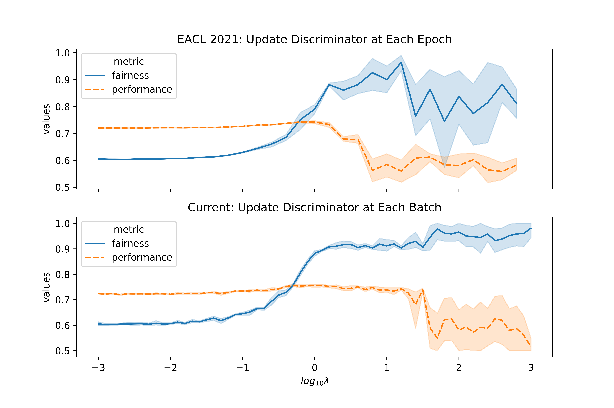
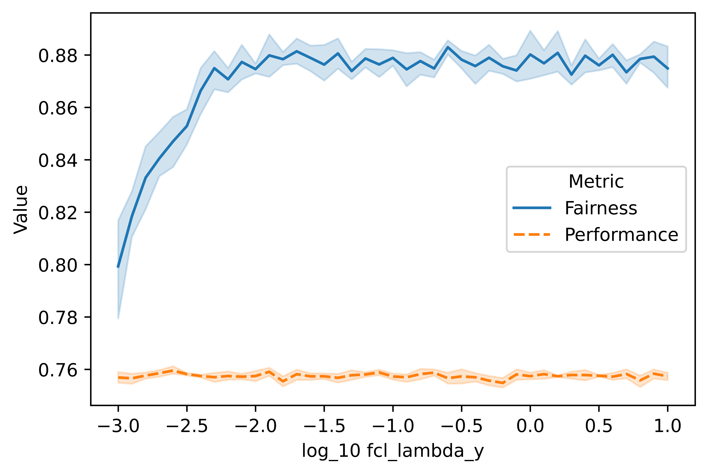
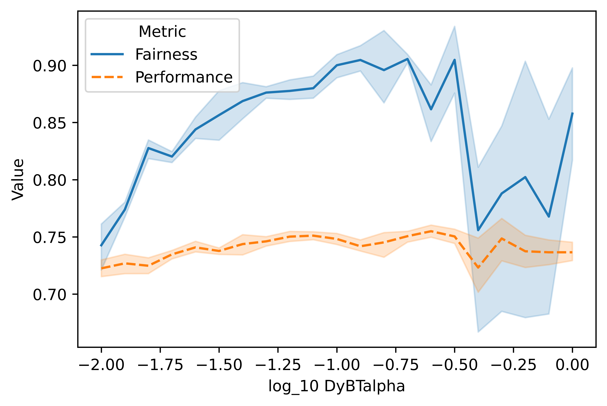
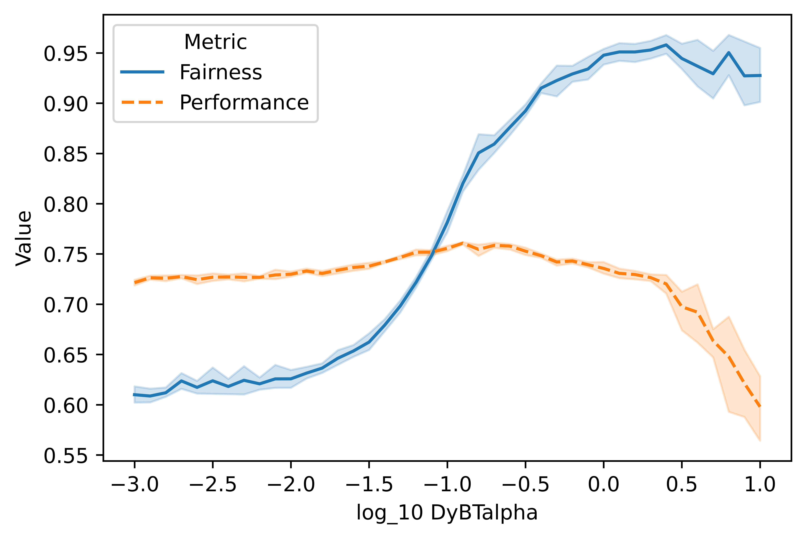
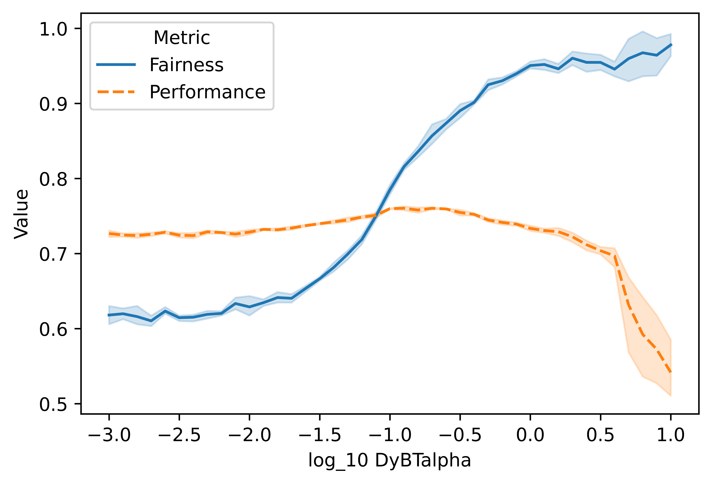

# Hyperparameter Tuning

Here we also provide detailed strategies of how we tune hyperparameters for each model.

## Adversarial Training
### Adv
- **Intro:**  
    Adversarial training employs an additional discriminator component, which shares the same encoder with the main model and is trained to identify the protected attributes. In addition to making correct predictions, the main model is also trained to unlearn the signal from the discriminator.
- **Hyperparameters:**
    ```bash
    python main.py --adv_debiasing
    ```

    | Name                    | Default value | Description                                                              |
    |-------------------------|---------------|--------------------------------------------------------------------------|
    | adv_update_frequency    | Batch         | Epoch \| Batch                                                           |
    | adv_level               | last_hidden   | input \| last_hidden \| output                                           |
    | adv_lambda              | 1             | strength of adversarial regularization                                   |
    | adv_hidden_size         | 300           | number of hidden units of each hidden layer for the main task classifier |
    | adv_n_hidden            | 2             | number of hidden layers                                                  |
    | adv_dropout             | 0             | dropout probability                                                      |
    | adv_activation_function | ReLu          | nonlinear activation function for the main task model                    |
    | adv_batch_norm          | False         | apply 1d batch norm to the model                                         |

- **Previous Work:**
    - **Discriminator architecture**  
        [Elazar and Goldberg (2018)](https://arxiv.org/pdf/1808.06640.pdf) explore different capacities of adversarial components by increasing the `adv_hidden_size`, and they show that there is no significant difference. Moreover, [Stacey et al. (2020)](https://aclanthology.org/2020.emnlp-main.665.pdf) investigate the influence of varying `adv_n_hidden` and `adv_activation_function` and show that even a linear adversary (i.e. a single layer MLP with a linear activation function) leads to similar results of using a more complex adversary.
    - **Adv level**  
        The most common choice of `adv_level` is the last hidden layer (`--adv_level last_hidden`), for example, a LSTM model followed by an output layer, where we take the output of LSTM as the input to the adversary. [Wang et al. (2019)](https://arxiv.org/pdf/1811.08489.pdf) also consider adding adversaries at different levels, for example at the input level, which leads to a mask for the inputs (`--adv_level input`), and at the intermediate level of the encoder. However, their experiments show that models using the last hidden layer (final convolutional layer of ResNet-50) consistently outperform other methods. [Wadsworth et al. (2018)](https://arxiv.org/abs/1807.00199) also train a different variant which takes logits as input and even argue that inputs from hidden layers are not necessary, and we implement this type of method as `--adv_level output`.
    - **Update frequency**  
        There are mainly two types of adversarial training strategies: (1) GAN-style, which iteratively train the discriminator to identify protected attributes and train the main model to make predictions while unlearn the discriminator (`--adv_update_frequency Epoch`); and (2) using Gradient Reversal Layer during backpropagation, which formulates the adversarial training as a multi-task learning that trains the main model and adversarial component jointly (`--adv_update_frequency Batch`).
    - **Lambda**  
        There is no doubt that lambda is the most important hyperparameter of adversarial learning, denoting the strength of adversarial regularization. By setting lambda to 0, any adversarial training would degrade to a vanilla model. 
- **Tuned:**
  - Lambda (`adv_lambda`): log-uniformly grid search between 10^-3 ~ 10^3 with 60 trials.  
  - Update frequency (`adv_update_frequency`): try both Batch and Epoch updates.

- **Not Tuned:**  
  - Adv level (`adv_level`): Most previous works have used `last_hidden` in their projects, and [Wang et al. (2019)](https://arxiv.org/pdf/1811.08489.pdf) have shown that `last_hidden` works the best in a complex NN, and thus we follow the same setting.
  - Discriminator architecture: Previous work have demonstrated that different model architectures lead to almost identical results, so we didn't tune these models. 
  
  Another reason of not tuning adv level and discriminator architecture related hyperparameters is that, these hyperparameters need to be tuned jointly with lambda, which is too much expensive. 

- **Results**
    <p align="center">
        
    </p>

### DAdv
- **Intro:**   
DAdv is a variant of Adv, which employs multiple subdiscriminators and encourages each subdiscriminator to identify protect attributes from different aspects.

- **Hyperparameters:**  
    ```bash
    python main.py --adv_debiasing --adv_num_subDiscriminator 3 --adv_diverse_lambda 10
    ```

    | Name                     | Default value | Description                                                                        |
    |--------------------------|---------------|------------------------------------------------------------------------------------|
    | adv_num_subDiscriminator | 1             | number of subdiscriminators.                                                       |
    | adv_diverse_lambda       | 0             | strength of difference loss to encourage diverse representations for ensemble adv. |

- **Previous Work:**  
  - **adv_num_subDiscriminator**  
    This controls the number of adversaries that are employed, and setting it to 1 essentially lead to a Adv. [Han et al. (2021)](https://arxiv.org/pdf/2101.10001.pdf) show that DAdv is quite robust to the number of sub-discriminators over the Moji dataset, and using 3 sub-discriminators is as good as using 5 or 8 sub-discriminators with properly tuned diverse lambda.
  - **adv_diverse_lambda**  
    Diverse lambda is the strength of difference loss, which encourages the diversity among sub-discriminators. By setting this to 0, DAdv degrades to an Ensemble Adv (3 subdiscriminators without any constraints). [Han et al. (2021)](https://arxiv.org/pdf/2101.10001.pdf) show that `adv_diverse_lambda` can be safely tuned separately with all other hyperparameters fixed. In addition, [Han et al. (2021)](https://arxiv.org/pdf/2101.10001.pdf) also show that a overly large diverse lambda can decrease the performance and fairness.
    
- **Tuned:**  
  - `adv_diverse_lambda`: although `adv_diverse_lambda` can be tuned separately, to get a trade-off plot for this method, we tune it jointly with lambda, where the range of `adv_diverse_lambda` is [0.01, 0.1, 1, 10, 100], adopting batch updating.

- **Not Tuned:**
  - `adv_num_subDiscriminator`: We follow [Han et al. (2021)](https://arxiv.org/pdf/2101.10001.pdf) in using 3 sub-discriminators.

## INLP

- **Intro:**   
    As the name of INLP, it iteratively projects fixed text representations to a null-space of protected attributes. It can be treated as a variant of Adv, where the encoder is fixed, and the discriminator unlearning is achieved by null-space projection rather than BP to the encoder. This limits the discriminator to be a generalized linear model, as the null-space can only be derived from the parameters of a single-layer model.
- **Hyperparameters:**
    ```bash
    python main.py --INLP
    ```

    | Name                            | Default value | Description                                                 |
    |---------------------------------|---------------|-------------------------------------------------------------|
    | INLP_discriminator_reweighting  | None          | if train the linear discriminator with reweighting          |
    | INLP_by_class                   | False         | the nullspace estimation by_class                             |
    | INLP_n                          | 300           | the maximum number of null-space projection iteration       |
    | INLP_min_acc                    | 0.0           | ignore the iteration if the acc is lower than the threshold |
- **Previous Work:**  
    [Shauli et al. (2020)](https://aclanthology.org/2020.acl-main.647.pdf) only introduce `INLP_by_class` and `INLP_n` in their paper. 
    - **INLP_by_class**  
        For the `by_class`, in each iteration, INLP train a classifier to predict the protected attribute not on the entire training set, but only on the training examples belonging to a single (randomly chosen) main-task class (e.g. profession). They use `by_class` as default setting for experiments over Moji and Bios. 
    - **INLP_n**  
        INLP_n for INLP is similar to lambda for Adv. A single null-space projection is not enough for removing protected attributes, so they iteratively train a linear discriminator and do the null-space projection `INLP_n` times. In theory, each null-space projection decreases the 1st rank of fixed representations, and in practice, this hyperparameter controls the trade-off. Following [Shauli et al. (2020)](https://aclanthology.org/2020.acl-main.647.pdf), we retrain a linear model for each iteration with the projected representations for the main task, and use the corresponding results for the trade-off plot. This is also the reason why we cannot report statistics of INLP given a certain trade-off hyperparameter value, as same iterations of different random seeds can lead to quite different results, making such statistics meaningless.

- **Tuned:**  
    - INLP_by_class: [True, False]
    - INLP_n: [0 - 300], as 300 is the dim of fixed representations.
    - INLP_discriminator_reweighting: [True, False]  
        This is **not** discussed in the original INLP paper but shown to be important for `by_class` settings. `INLP_discriminator_reweighting` indicates whether or not to use instance reweighting during the linear discriminator training. Specifically, the balanced model uses the values of protected label to automatically adjust weights inversely proportional to protected group frequencies in the input data. Considering a `by_class` example in Moji dataset, for the Positive class, 80% instances are labeled as AAE, and thus a trained discriminator without RW will be biased to AAE. The null-space derived form such a biased discriminator is also a biased estimation of the actual null-space. Given this, INLP_discriminator_reweighting is an important hyperparameter when protected labels are imbalanced distributed.
    - INLP_min_acc: [0, 0.5]  
        This is **not** discussed in the INLP paper. `INLP_min_acc` is a threshold for the discriminator accuracy over the dev set. In the Moji dataset, we used a balanced dev set, thus if a discriminator achieves an accuracy that is smaller than 0.5, we could argue that it is not able to represent the correct null-space, and thus we skip the null-space projection at this iteration, and jump directly to training another discriminator. By setting a large `INLP_min_acc` value, we could improve the robustness against uncertainty in discriminator training. Moreover, `INLP_min_acc` could be used to handle the problem caused by imbalanced training in `by_class` without `INLP_discriminator_reweighting`, as it will ignore those biased model that can not achieve a reasonable accuracy over the balanced dev set.
- **Not Tuned:**  
    - Discriminator related hyperparameters. There are lots of hyperparameters associated with discriminator training, for example, architectures using Logistic Regression verse Linear SVM, penalty, tolerance for stopping criteria, optimizer, etc. [Shauli et al. (2020)](https://aclanthology.org/2020.acl-main.647.pdf) do not discuss these choices in their paper, and we found that the results are quite robust to these hyperparameters in our previous experiments. Thus, we use default setting of the Logistic Regression model in Sci-kit Learn Lib.

- **Results**  
    <p align="center">
        
    </p>

    - `by_class`: It is clear that setting `by_class=True` can improve trade-offs.
    - `INLP_discriminator_reweighting`: consistent with our discussion, `INLP_discriminator_reweighting` is essential for the `by_class` setting, which leads to better results. But for the overall setting (`by_class=False`), `INLP_discriminator_reweighting` dose not lead to significant differences as the the protected label is balanced at the overall level in Moji dataset.
    - `INLP_min_acc`: By setting `INLP_min_acc=0.5`, we can solve the problem caused by imbalanced training to a certain extent. As shown in the right figure, the gap between different colors are reduced, implying that balanced training will not be necessary for by_class given a proper `INLP_min_acc`.

## FairSCL  

- **Intro:** 

- **Hyperparameters:**  
    ```bash
    python main.py --FCL
    ```

    | Name                    | Default value | Description                                                     |
    |-------------------------|---------------|-----------------------------------------------------------------|
    | fcl_lambda_y            | 0.1           | strength of the supervised contrastive loss                     |
    | fcl_lambda_g            | 0.1           | strength of the fair supervised contrastive loss                |
    | fcl_temperature_y       | 0.01          | temperature for the fcl wrt main task learning                  |
    | fcl_temperature_g       | 0.01          | temperature for the fcl wrt protected attribute unlearning      |
    | fcl_base_temperature_y  | 0.01          | base temperature for the fcl wrt main task learning             |
    | fcl_base_temperature_g  | 0.01          | base temperature for the fcl wrt protected attribute unlearning |

- **Previous Work:**  
    [Shen et al. (2021)](https://arxiv.org/abs/2109.10645) show that using the same weight for `fcl_lambda_y` and `fcl_lambda_g` leads to better results, so we use the same strategy for tuning `fcl_lambda_y` and `fcl_lambda_g`.
- **Tuned:**  
    - same valued `fcl_lambda_y` and `fcl_lambda_g`: log-uniformly between 10^-3 ~ 10^1, 40 trials.
- **Not Tuned:**  
    - temperature values
- **Results**  
    <p align="center">
        
    </p>

## Balanced Learning

Different objectives have been established in previous work. We now briefly described five types when considering balanced learning for target classes and demographic attributes:

  1. Balanced Target Classes: this has been widely used in long-tail learning literature, encouraging the trained model to be equally good to both head and tail classes. We denote this objective as `y` in our implementation.
  2. Balanced Demographics: this objective encourages the model to perform equally well to different demographic groups, closely related to the Demographic Parity criterion. We denote this objective as `g` in our implementation.
  3. Conditional Balance of Demographics: as suggested by Equalized Odds and its relaxation, Equal Opportunity, the model is expected to be fair to different groups conditioned on target classes. We denote this objective as `stratified_y`, meaning that demographics are stratified balanced according to y distributions.
  4. Conditional Balance of Classes: Like `stratified_y`, we have also implemented `stratified_g`, which will only be used for discriminator training. For example, when training INLP discriminators under the `by_class` setting, the balanced training of discriminators requires demographics to be balanced within each target class.
  5. Joint Balance: demographics and classes are jointly balanced, equivalent to using the combination of `y` and  `stratified_y`  or the combination of  `g` and `stratified_g` at the same time. This objective can be treated as handling class imbalance and fairness, denoted as `joint`.

In order to achieve those objectives, we have implemented 4 types of methods:
  
  |                         | Static                           | Dynamic            |
  |-------------------------|----------------------------------|--------------------|
  |**Processing Data**      |   Down-sampling; Re-sampling     | FairBatch          |
  |**Manipulating Loss**    |   Instance Reweighting           | Group Difference   |

1. Static-data-processing: this type of method creates a balanced dataset from the original training set, such that proportions of different subsets are the same.
2. Static-loss-manipulating: weights of different subsets of instances are derived from the empirical distribution in the training set. 
3. Dynamic-data-processing: the subset proportions within each mini-batch are dynamically adjusted during training.
4. Dynamic-loss-manipulating: the weights of different subsets of instances are dynamically adjusted during training.

### FairBatch

- **Intro:**   
  This method aims at minimizing CE loss gap though resampling. Specifically, it dynamically adjusts the resampling probability of each group according to their losses, i.e., increasing the probability of groups with larger CE loss and decreasing the probability otherwise. 

- **Hyperparameters:**  
    ```bash
    python main.py --DyBT FairBatch --DyBTObj stratified_y 
    ```

    | Name       | Default value | Description                                                  |
    |------------|---------------|--------------------------------------------------------------|
    | DyBTalpha  | 0.1           | a positive number for dynamic adjustment.                    |
- **Previous Work:**  
    - DyBTalpha: adjustment rate of resampling probabilities.
- **Tuned:**  
    - DyBTalpha: log-uniformly between 10^-2 ~ 10^0, 20 trials.

- **Not Tuned:**  
    Besides Equal Opportunity, the original FairBatch paper also proposes objectives for Equalized Odds and Demographic Parity. However, their implementations are formulations that are very specific to binary classification with binary groups. In order to support multi-class target labels and demographic attributes, we have made modifications. As a result, our re-implementation of FairBatch with `--DyBTObj stratified_y ` is the same as the Equalized Odds formulation in the original paper, which considers both TPR and FPR in the binary situation, which is consistent with our RMS TPR GAP evaluation metric.
- **Results**  
    <p align="center">
        
    </p>

### Balanced Training

- **Intro:**   
    Balance the training through resampling and instance reweighting.
- **Hyperparameters:**  

    ```bash
    python main.py --BT Reweighting --BTObj joint
    ```

    | Name       | Default value | Description                                                  |
    |------------|---------------|--------------------------------------------------------------|
    | BT         | False         | Reweighting or Resampling                                    |
    | BTObj      | None          | joint \| y \| g \| stratified_y \| stratified_g \| EO        |

- **Previous Work:**  
    We follow [Han et al.](https://arxiv.org/abs/2109.08253) in comparing joint balance, balance demographic, condition balance, and EO balance.

- **Tuned:**  
    - BT: [Reweighting, Resampling]
    - BTObj:  [joint (JB), g (BD), stratified_y (CB), EO]
- **Not Tuned:**  
    - Model architecture. BT models share the same hyperparameters as the naive trained model. Tuning such hyperparameters, for example batch size and learning rate, may lead to better results for BT models.

### Group Difference

- **Intro:**   
    [Shen et al. (2022)]() propose two methods to minimize the CE loss gap across different groups during training: (1) the `Diff` method focuses on the differences across demographic groups within each class, and (2) the `Mean` method additionally minimizes the gap between different classes, such that gaps are jointly minimized with respect to demographic groups and target classes.

- **Hyperparameters:**    
    ```bash
    # L_diff as described in Section 3.2
    python main.py --DyBT GroupDifference --DyBTObj EO

    # L_mean as described in Section 3.3 
    python main.py --DyBT GroupDifference --DyBTObj joint
    ```

    | Name       | Default value | Description                                                  |
    |------------|---------------|--------------------------------------------------------------|
    | DyBTObj    | None          | joint \| y \| g \| stratified_y \| stratified_g \| EO        |
    | DyBTalpha  | 0.1           | a positive number for dynamic adjustment.                    |

- **Previous Work:**  
    Following [Shen et al. (2022)](), we tune the strength of CE difference penalty.
- **Tuned:**   
    - DyBTObj: [joint, EO]
    - DyBTalpha: 40 trials for each setting
      - Moji-joint: log-uniformly grid search between 10^-3 ~ 10^1
      - Moji-EO: log-uniformly grid search between 10^-3 ~ 10^1
      - Bios-joint: log-uniformly grid search between 10^-3 ~ 10^-1
      - Bios-EO: log-uniformly grid search between 10^-3 ~ 10^-1
- **Not Tuned:**  
    None

- **Results**  
    - Diff
        <p align="center">
            
        </p>
    - Mean
       <p align="center">
            
        </p>
