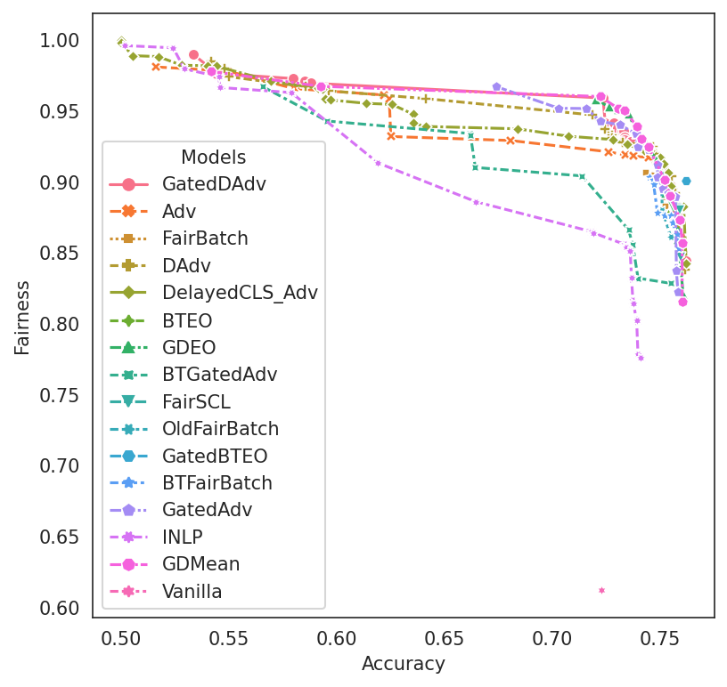

# Basic Usage

[](https://colab.research.google.com/github/HanXudong/fairlib/blob/main/tutorial/demo.ipynb)

Welcome to the *fairlib* interactive tutorial

In this tutorial, we will:
- Show how to install *fairlib*, and prepare a preprocessed sentiment analysis dataset.
- Show how to train a model with or without debiasing.
- Show how to analyze the results, including creating tables and figures
- Show how to run experiments over customized datasets.

## 1. Installation


```python
!pip install fairlib
```

    Collecting fairlib
      Downloading fairlib-0.0.3-py3-none-any.whl (63 kB)
         |████████████████████████████████| 63 kB 1.2 MB/s 
    [?25hCollecting transformers
      Downloading transformers-4.18.0-py3-none-any.whl (4.0 MB)
         |████████████████████████████████| 4.0 MB 14.6 MB/s 
    [?25hRequirement already satisfied: PyYAML in /usr/local/lib/python3.7/dist-packages (from fairlib) (3.13)
    Collecting pickle5
      Downloading pickle5-0.0.12-cp37-cp37m-manylinux_2_5_x86_64.manylinux1_x86_64.whl (256 kB)
         |████████████████████████████████| 256 kB 36.9 MB/s 
    [?25hRequirement already satisfied: numpy in /usr/local/lib/python3.7/dist-packages (from fairlib) (1.21.6)
    Requirement already satisfied: matplotlib in /usr/local/lib/python3.7/dist-packages (from fairlib) (3.2.2)
    Requirement already satisfied: seaborn in /usr/local/lib/python3.7/dist-packages (from fairlib) (0.11.2)
    Requirement already satisfied: docopt in /usr/local/lib/python3.7/dist-packages (from fairlib) (0.6.2)
    Requirement already satisfied: tqdm in /usr/local/lib/python3.7/dist-packages (from fairlib) (4.64.0)
    Requirement already satisfied: torch in /usr/local/lib/python3.7/dist-packages (from fairlib) (1.11.0+cu113)
    Requirement already satisfied: pandas in /usr/local/lib/python3.7/dist-packages (from fairlib) (1.3.5)
    Requirement already satisfied: scikit-learn in /usr/local/lib/python3.7/dist-packages (from fairlib) (1.0.2)
    Requirement already satisfied: python-dateutil>=2.1 in /usr/local/lib/python3.7/dist-packages (from matplotlib->fairlib) (2.8.2)
    Requirement already satisfied: kiwisolver>=1.0.1 in /usr/local/lib/python3.7/dist-packages (from matplotlib->fairlib) (1.4.2)
    Requirement already satisfied: cycler>=0.10 in /usr/local/lib/python3.7/dist-packages (from matplotlib->fairlib) (0.11.0)
    Requirement already satisfied: pyparsing!=2.0.4,!=2.1.2,!=2.1.6,>=2.0.1 in /usr/local/lib/python3.7/dist-packages (from matplotlib->fairlib) (3.0.8)
    Requirement already satisfied: typing-extensions in /usr/local/lib/python3.7/dist-packages (from kiwisolver>=1.0.1->matplotlib->fairlib) (4.2.0)
    Requirement already satisfied: six>=1.5 in /usr/local/lib/python3.7/dist-packages (from python-dateutil>=2.1->matplotlib->fairlib) (1.15.0)
    Requirement already satisfied: pytz>=2017.3 in /usr/local/lib/python3.7/dist-packages (from pandas->fairlib) (2022.1)
    Requirement already satisfied: scipy>=1.1.0 in /usr/local/lib/python3.7/dist-packages (from scikit-learn->fairlib) (1.4.1)
    Requirement already satisfied: threadpoolctl>=2.0.0 in /usr/local/lib/python3.7/dist-packages (from scikit-learn->fairlib) (3.1.0)
    Requirement already satisfied: joblib>=0.11 in /usr/local/lib/python3.7/dist-packages (from scikit-learn->fairlib) (1.1.0)
    Requirement already satisfied: packaging>=20.0 in /usr/local/lib/python3.7/dist-packages (from transformers->fairlib) (21.3)
    Collecting tokenizers!=0.11.3,<0.13,>=0.11.1
      Downloading tokenizers-0.12.1-cp37-cp37m-manylinux_2_12_x86_64.manylinux2010_x86_64.whl (6.6 MB)
         |████████████████████████████████| 6.6 MB 44.3 MB/s 
    [?25hCollecting huggingface-hub<1.0,>=0.1.0
      Downloading huggingface_hub-0.5.1-py3-none-any.whl (77 kB)
         |████████████████████████████████| 77 kB 5.2 MB/s 
    [?25hRequirement already satisfied: filelock in /usr/local/lib/python3.7/dist-packages (from transformers->fairlib) (3.6.0)
    Requirement already satisfied: regex!=2019.12.17 in /usr/local/lib/python3.7/dist-packages (from transformers->fairlib) (2019.12.20)
    Collecting sacremoses
      Downloading sacremoses-0.0.49-py3-none-any.whl (895 kB)
         |████████████████████████████████| 895 kB 18.7 MB/s 
    [?25hRequirement already satisfied: importlib-metadata in /usr/local/lib/python3.7/dist-packages (from transformers->fairlib) (4.11.3)
    Collecting PyYAML
      Downloading PyYAML-6.0-cp37-cp37m-manylinux_2_5_x86_64.manylinux1_x86_64.manylinux_2_12_x86_64.manylinux2010_x86_64.whl (596 kB)
         |████████████████████████████████| 596 kB 38.3 MB/s 
    [?25hRequirement already satisfied: requests in /usr/local/lib/python3.7/dist-packages (from transformers->fairlib) (2.23.0)
    Requirement already satisfied: zipp>=0.5 in /usr/local/lib/python3.7/dist-packages (from importlib-metadata->transformers->fairlib) (3.8.0)
    Requirement already satisfied: urllib3!=1.25.0,!=1.25.1,<1.26,>=1.21.1 in /usr/local/lib/python3.7/dist-packages (from requests->transformers->fairlib) (1.24.3)
    Requirement already satisfied: certifi>=2017.4.17 in /usr/local/lib/python3.7/dist-packages (from requests->transformers->fairlib) (2021.10.8)
    Requirement already satisfied: idna<3,>=2.5 in /usr/local/lib/python3.7/dist-packages (from requests->transformers->fairlib) (2.10)
    Requirement already satisfied: chardet<4,>=3.0.2 in /usr/local/lib/python3.7/dist-packages (from requests->transformers->fairlib) (3.0.4)
    Requirement already satisfied: click in /usr/local/lib/python3.7/dist-packages (from sacremoses->transformers->fairlib) (7.1.2)
    Installing collected packages: PyYAML, tokenizers, sacremoses, huggingface-hub, transformers, pickle5, fairlib
      Attempting uninstall: PyYAML
        Found existing installation: PyYAML 3.13
        Uninstalling PyYAML-3.13:
          Successfully uninstalled PyYAML-3.13
    Successfully installed PyYAML-6.0 fairlib-0.0.3 huggingface-hub-0.5.1 pickle5-0.0.12 sacremoses-0.0.49 tokenizers-0.12.1 transformers-4.18.0
    


```python
import fairlib
```

## 2. Prepare Dataset

In this notebook, we will be using the Moji dataset, where each tweet is annotated with a binary sentiment label (happy verse sad) and a binary race label (AAE verse SAE).
Followings are random examples from the Moji dataset.

| Text | Sentiment | Race |
| ---- | --------- | ---- |
| Dfl somebody said to me yesterday that how can u u have a iPhone or an S3 an ur phone off dfl | Positive | AAE|
| smh I bet maybe u just don't care bout poor boo no more | Negative | AAE |
| I actually put jeans on today and I already wanna go put on leggings or yogas | Positive | SAE |
| I'm sitting next to the most awkward couple on the plane like they are making out and holding hands , I just can't | Negative | SAE |


For simplification, here we directly use the encoded Moji dataset provided by [Ravfogel et al. \(2020\)](https://github.com/shauli-ravfogel/nullspace_projection/blob/master/download_data.sh). Original tweets are encoded with the pre-trained [DeepMoji model](https://github.com/bfelbo/DeepMoji) as 2304d vectors and grouped by the target classes  and race labels . The following cell creates a `data` directory for saving the pre-processed data.


```python
!mkdir -p data/deepmoji
!wget 'https://storage.googleapis.com/ai2i/nullspace/deepmoji/pos_pos.npy' -P 'data/deepmoji'
!wget 'https://storage.googleapis.com/ai2i/nullspace/deepmoji/pos_neg.npy' -P 'data/deepmoji'
!wget 'https://storage.googleapis.com/ai2i/nullspace/deepmoji/neg_pos.npy' -P 'data/deepmoji'
!wget 'https://storage.googleapis.com/ai2i/nullspace/deepmoji/neg_neg.npy' -P 'data/deepmoji'
```

    --2022-05-02 02:46:21--  https://storage.googleapis.com/ai2i/nullspace/deepmoji/pos_pos.npy
    Resolving storage.googleapis.com (storage.googleapis.com)... 74.125.135.128, 74.125.142.128, 74.125.195.128, ...
    Connecting to storage.googleapis.com (storage.googleapis.com)|74.125.135.128|:443... connected.
    HTTP request sent, awaiting response... 200 OK
    Length: 405494864 (387M) [application/octet-stream]
    Saving to: ‘data/deepmoji/pos_pos.npy’
    
    pos_pos.npy         100%[===================>] 386.71M  5.59MB/s    in 67s     
    
    2022-05-02 02:47:29 (5.77 MB/s) - ‘data/deepmoji/pos_pos.npy’ saved [405494864/405494864]
    
    --2022-05-02 02:47:29--  https://storage.googleapis.com/ai2i/nullspace/deepmoji/pos_neg.npy
    Resolving storage.googleapis.com (storage.googleapis.com)... 74.125.142.128, 74.125.195.128, 2607:f8b0:400e:c0d::80, ...
    Connecting to storage.googleapis.com (storage.googleapis.com)|74.125.142.128|:443... connected.
    HTTP request sent, awaiting response... 200 OK
    Length: 405504080 (387M) [application/octet-stream]
    Saving to: ‘data/deepmoji/pos_neg.npy’
    
    pos_neg.npy         100%[===================>] 386.72M  6.03MB/s    in 61s     
    
    2022-05-02 02:48:31 (6.34 MB/s) - ‘data/deepmoji/pos_neg.npy’ saved [405504080/405504080]
    
    --2022-05-02 02:48:31--  https://storage.googleapis.com/ai2i/nullspace/deepmoji/neg_pos.npy
    Resolving storage.googleapis.com (storage.googleapis.com)... 74.125.195.128, 173.194.202.128, 74.125.20.128, ...
    Connecting to storage.googleapis.com (storage.googleapis.com)|74.125.195.128|:443... connected.
    HTTP request sent, awaiting response... 200 OK
    Length: 405494864 (387M) [application/octet-stream]
    Saving to: ‘data/deepmoji/neg_pos.npy’
    
    neg_pos.npy         100%[===================>] 386.71M  5.79MB/s    in 67s     
    
    2022-05-02 02:49:40 (5.75 MB/s) - ‘data/deepmoji/neg_pos.npy’ saved [405494864/405494864]
    
    --2022-05-02 02:49:40--  https://storage.googleapis.com/ai2i/nullspace/deepmoji/neg_neg.npy
    Resolving storage.googleapis.com (storage.googleapis.com)... 74.125.195.128, 173.194.202.128, 74.125.20.128, ...
    Connecting to storage.googleapis.com (storage.googleapis.com)|74.125.195.128|:443... connected.
    HTTP request sent, awaiting response... 200 OK
    Length: 405504080 (387M) [application/octet-stream]
    Saving to: ‘data/deepmoji/neg_neg.npy’
    
    neg_neg.npy         100%[===================>] 386.72M  6.88MB/s    in 59s     
    
    2022-05-02 02:50:40 (6.55 MB/s) - ‘data/deepmoji/neg_neg.npy’ saved [405504080/405504080]
    
    

We split the dataset into the train, dev, and test sets.


```python
fairlib.utils.seed_everything(2022)
```


```python
import numpy as np
import os

def read_data_file(input_file: str):
    vecs = np.load(input_file)

    np.random.shuffle(vecs)

    return vecs[:40000], vecs[40000:42000], vecs[42000:44000]
```


```python
in_dir = "data/deepmoji"
out_dir = "data/deepmoji"

os.makedirs(out_dir, exist_ok=True)

for split in ['pos_pos', 'pos_neg', 'neg_pos', 'neg_neg']:
    train, dev, test = read_data_file(in_dir + '/' + split + '.npy')
    for split_dir, data in zip(['train', 'dev', 'test'], [train, dev, test]):
        os.makedirs(out_dir + '/' + split_dir, exist_ok=True)
        np.save(out_dir + '/' + split_dir + '/' + split + '.npy', data)
```

## 3. Standard Usage

So far, we have installed the *fairlib* and prepared the dataset for training. 
Now let's take a look at an example of training a standard sentiment analysis model naively without debiasing. 

Before moving to the training, we first define a list of hyperparameters that will be repeatedly used in this tutorial.


```python
Shared_options = {
    # The name of the dataset, corresponding dataloader will be used,
    "dataset":  "Moji",

    # Specifiy the path to the input data
    "data_dir": "data/deepmoji",

    # Device for computing, -1 is the cpu; non-negative numbers indicate GPU id.
    "device_id":    -1,

    # The default path for saving experimental results
    "results_dir":  r"results",

    # Will be used for saving experimental results
    "project_dir":  r"dev",

    # We will focusing on TPR GAP, implying the Equalized Odds for binary classification.
    "GAP_metric_name":  "TPR_GAP",

    # The overall performance will be measured as accuracy
    "Performance_metric_name":  "accuracy",

    # Model selections are based on distance to optimum, see section 4 in our paper for more details
    "selection_criterion":  "DTO",

    # Default dirs for saving checkpoints
    "checkpoint_dir":   "models",
    "checkpoint_name":  "checkpoint_epoch",

    # Loading experimental results
    "n_jobs":   1,
}
```


```python
!rm -rf results
```

Without an explicitly specified debiasing approach, *fairlib* by default trains and evaluates a binary MLP classifier. As a result, we only need to define: 
1. Path to the dataset.
2. Dataset name, which will be used to initialize built-in dataloaders.
3. Experiment id, which is the identifier of the current experiment, and experimental results with respect to the same `exp_id` will be saved in the same dir.


```python
args = {
    "dataset":Shared_options["dataset"], 
    "data_dir":Shared_options["data_dir"],
    "device_id":Shared_options["device_id"],

    # Give a name to the exp, which will be used in the path
    "exp_id":"vanilla",
}

# Init the argument
options = fairlib.BaseOptions()
state = options.get_state(args=args, silence=True)
```

    INFO:root:Unexpected args: ['-f', '/root/.local/share/jupyter/runtime/kernel-94fdc7f5-0523-4a20-889a-536d5b502976.json']
    INFO:root:Logging to ./results/dev/Moji/vanilla/output.log
    

    2022-05-02 02:50:46 [INFO ]  ======================================== 2022-05-02 02:50:46 ========================================
    2022-05-02 02:50:46 [INFO ]  Base directory is ./results/dev/Moji/vanilla
    Loaded data shapes: (99998, 2304), (99998,), (99998,)
    Loaded data shapes: (8000, 2304), (8000,), (8000,)
    Loaded data shapes: (7998, 2304), (7998,), (7998,)
    

### Train a model without explicitly debiasing

Given the 2304d encoded text representations, the default model in *fairlib* is a 3-layer MLP classifier with Tanh activation functions in between. 

To customize the MLP architecture, we can specify the hyperparameters in the `state` as follows
```python
state.hidden_size = 300
state.n_hidden = 2
state.activation_function = "Tanh"
```

Please see the [model architecture section](https://github.com/HanXudong/fairlib/blob/main/docs/usage.md#basic-operation) for more details about the hyperparameters corresponding to the model architecture.


```python
fairlib.utils.seed_everything(2022)

# Init Model
model = fairlib.networks.get_main_model(state)
```

    2022-05-02 02:50:47 [INFO ]  MLP( 
    2022-05-02 02:50:47 [INFO ]    (output_layer): Linear(in_features=300, out_features=2, bias=True)
    2022-05-02 02:50:47 [INFO ]    (AF): Tanh()
    2022-05-02 02:50:47 [INFO ]    (hidden_layers): ModuleList(
    2022-05-02 02:50:47 [INFO ]      (0): Linear(in_features=2304, out_features=300, bias=True)
    2022-05-02 02:50:47 [INFO ]      (1): Tanh()
    2022-05-02 02:50:47 [INFO ]      (2): Linear(in_features=300, out_features=300, bias=True)
    2022-05-02 02:50:47 [INFO ]      (3): Tanh()
    2022-05-02 02:50:47 [INFO ]    )
    2022-05-02 02:50:47 [INFO ]    (criterion): CrossEntropyLoss()
    2022-05-02 02:50:47 [INFO ]  )
    2022-05-02 02:50:47 [INFO ]  Total number of parameters: 782402 
    
    

A list of hyperparameters has been predefined in *fairlib*, so we can now directly train a model with the model class's built-in `train_self` method.

Please see the [link](https://github.com/HanXudong/fairlib/blob/23a32a6f4b3db00134bd651a6e0aa0747ba0adc2/fairlib/src/base_options.py#L162-L200) for all hyperparameters associated with model training.


```python
model.train_self()
```

    2022-05-02 02:50:48 [INFO ]  Epoch:    0 [      0/  99998 ( 0%)]	Loss: 0.6906	 Data Time: 0.02s	Train Time: 0.20s
    2022-05-02 02:50:51 [INFO ]  Epoch:    0 [  51200/  99998 (51%)]	Loss: 0.3926	 Data Time: 0.37s	Train Time: 3.35s
    2022-05-02 02:50:56 [INFO ]  Evaluation at Epoch 0
    2022-05-02 02:50:56 [INFO ]  Validation accuracy: 72.55	macro_fscore: 72.44	micro_fscore: 72.55	TPR_GAP: 40.07	FPR_GAP: 40.07	PPR_GAP: 39.10	
    2022-05-02 02:50:56 [INFO ]  Test accuracy: 71.41	macro_fscore: 71.30	micro_fscore: 71.41	TPR_GAP: 39.01	FPR_GAP: 39.01	PPR_GAP: 37.84	
    2022-05-02 02:50:56 [INFO ]  Epoch:    1 [      0/  99998 ( 0%)]	Loss: 0.4105	 Data Time: 0.02s	Train Time: 0.06s
    2022-05-02 02:50:59 [INFO ]  Epoch:    1 [  51200/  99998 (51%)]	Loss: 0.4156	 Data Time: 0.39s	Train Time: 3.32s
    2022-05-02 02:51:03 [INFO ]  Evaluation at Epoch 1
    2022-05-02 02:51:03 [INFO ]  Validation accuracy: 72.36	macro_fscore: 72.32	micro_fscore: 72.36	TPR_GAP: 39.81	FPR_GAP: 39.81	PPR_GAP: 39.27	
    2022-05-02 02:51:03 [INFO ]  Test accuracy: 71.01	macro_fscore: 70.98	micro_fscore: 71.01	TPR_GAP: 39.40	FPR_GAP: 39.40	PPR_GAP: 38.64	
    2022-05-02 02:51:03 [INFO ]  Epoch:    2 [      0/  99998 ( 0%)]	Loss: 0.3433	 Data Time: 0.01s	Train Time: 0.06s
    2022-05-02 02:51:07 [INFO ]  Epoch:    2 [  51200/  99998 (51%)]	Loss: 0.3734	 Data Time: 0.37s	Train Time: 3.31s
    2022-05-02 02:51:11 [INFO ]  Epochs since last improvement: 1
    2022-05-02 02:51:11 [INFO ]  Evaluation at Epoch 2
    2022-05-02 02:51:11 [INFO ]  Validation accuracy: 72.42	macro_fscore: 72.37	micro_fscore: 72.42	TPR_GAP: 40.91	FPR_GAP: 40.91	PPR_GAP: 40.20	
    2022-05-02 02:51:11 [INFO ]  Test accuracy: 70.98	macro_fscore: 70.93	micro_fscore: 70.98	TPR_GAP: 40.21	FPR_GAP: 40.21	PPR_GAP: 39.39	
    2022-05-02 02:51:11 [INFO ]  Epoch:    3 [      0/  99998 ( 0%)]	Loss: 0.3773	 Data Time: 0.02s	Train Time: 0.06s
    2022-05-02 02:51:15 [INFO ]  Epoch:    3 [  51200/  99998 (51%)]	Loss: 0.3479	 Data Time: 0.37s	Train Time: 3.28s
    2022-05-02 02:51:19 [INFO ]  Epochs since last improvement: 2
    2022-05-02 02:51:19 [INFO ]  Evaluation at Epoch 3
    2022-05-02 02:51:19 [INFO ]  Validation accuracy: 72.09	macro_fscore: 71.92	micro_fscore: 72.09	TPR_GAP: 41.54	FPR_GAP: 41.54	PPR_GAP: 40.17	
    2022-05-02 02:51:19 [INFO ]  Test accuracy: 71.17	macro_fscore: 71.02	micro_fscore: 71.17	TPR_GAP: 40.32	FPR_GAP: 40.32	PPR_GAP: 38.96	
    2022-05-02 02:51:19 [INFO ]  Epoch:    4 [      0/  99998 ( 0%)]	Loss: 0.3839	 Data Time: 0.01s	Train Time: 0.06s
    2022-05-02 02:51:23 [INFO ]  Epoch:    4 [  51200/  99998 (51%)]	Loss: 0.3499	 Data Time: 0.39s	Train Time: 3.30s
    2022-05-02 02:51:26 [INFO ]  Epochs since last improvement: 3
    2022-05-02 02:51:27 [INFO ]  Evaluation at Epoch 4
    2022-05-02 02:51:27 [INFO ]  Validation accuracy: 71.50	macro_fscore: 71.43	micro_fscore: 71.50	TPR_GAP: 42.76	FPR_GAP: 42.76	PPR_GAP: 42.00	
    2022-05-02 02:51:27 [INFO ]  Test accuracy: 70.49	macro_fscore: 70.43	micro_fscore: 70.49	TPR_GAP: 41.37	FPR_GAP: 41.37	PPR_GAP: 40.51	
    2022-05-02 02:51:27 [INFO ]  Epoch:    5 [      0/  99998 ( 0%)]	Loss: 0.3746	 Data Time: 0.01s	Train Time: 0.07s
    2022-05-02 02:51:31 [INFO ]  Epoch:    5 [  51200/  99998 (51%)]	Loss: 0.3748	 Data Time: 0.38s	Train Time: 3.30s
    2022-05-02 02:51:34 [INFO ]  Epochs since last improvement: 4
    2022-05-02 02:51:35 [INFO ]  Evaluation at Epoch 5
    2022-05-02 02:51:35 [INFO ]  Validation accuracy: 72.67	macro_fscore: 72.60	micro_fscore: 72.67	TPR_GAP: 39.17	FPR_GAP: 39.17	PPR_GAP: 38.35	
    2022-05-02 02:51:35 [INFO ]  Test accuracy: 71.69	macro_fscore: 71.62	micro_fscore: 71.69	TPR_GAP: 37.97	FPR_GAP: 37.97	PPR_GAP: 36.91	
    2022-05-02 02:51:35 [INFO ]  Epoch:    6 [      0/  99998 ( 0%)]	Loss: 0.3624	 Data Time: 0.01s	Train Time: 0.07s
    2022-05-02 02:51:38 [INFO ]  Epoch:    6 [  51200/  99998 (51%)]	Loss: 0.3529	 Data Time: 0.37s	Train Time: 3.28s
    2022-05-02 02:51:42 [INFO ]  Epochs since last improvement: 5
    2022-05-02 02:51:42 [INFO ]  Evaluation at Epoch 6
    2022-05-02 02:51:42 [INFO ]  Validation accuracy: 72.70	macro_fscore: 72.62	micro_fscore: 72.70	TPR_GAP: 38.29	FPR_GAP: 38.29	PPR_GAP: 37.50	
    2022-05-02 02:51:42 [INFO ]  Test accuracy: 71.76	macro_fscore: 71.70	micro_fscore: 71.76	TPR_GAP: 37.59	FPR_GAP: 37.59	PPR_GAP: 36.79	
    

After each iteration (epoch), evaluation results over the validation set and test set will be printed, including metrics for both performance and fairness.
- Performance metrics: accuracy, macro F1 score, and micro F1 score
- Bias metrics： RMS aggregated TPR GAP, RMS aggregated TNR GAP, and RMS aggregated PPR GAP.

Briefly, these bias metrics measure how protected groups perform differently from each other. For example, the TPR GAP measures the True Positive Rate difference between AAE and SAE. All these three bias metrics should be 0 for a fair model.

Moreover, GAP metrics could be aligned with particular well-known fairness metrics. For example, TPR GAP corresponds to Equal Opportunity Fairness, and Both TPR GAP and FPR GAP measure equalized Odds criterion. Please refer to [Barocas et al. 2019](https://fairmlbook.org/classification.html).

It can be seen that the naively trained model achieves around 72\% accuracy and 39\% GAP, which is not ideal.

### Bias mitigation through balanced training and adversarial training

To mitigate bias in the sentiment analysis, we show an example of employing balanced training and adversarial training simultaneously.

In terms of the balanced training, we resample each group of instances with different probabilities corresponding to the Equal Opportunity fairness criterion ([Han et al. 2021](https://arxiv.org/abs/2109.08253)).

Adversarial training ([Li et al. 2018](https://arxiv.org/abs/1805.06093)) is applied at the training time, where an extra adversary component is trained to identify protected labels (AAE verse SAE in this tutorial) from the intermediate representations of the sentiment analysis model. The sentiment analysis model will be trained to unlearn the adversary, i.e., remove race information from its intermediate representations, and thus makes fairer predictions.

Balanced training and adversarial training are built-in methods in *fairlib*, so we can adopt these two methods by simply specifying corresponding arguments, as shown in the following cell.

- A list of supported bias mitigation methods is shown [here](https://github.com/HanXudong/fairlib/blob/main/docs/supported_bias_mitigation_algorithms.md)
- The [usage](https://github.com/HanXudong/fairlib/blob/main/docs/usage.md) file introduces further options associated with each debiasing method, such as the adversary architecture and balanced training strategies.


```python
debiasing_args = {
    "dataset":Shared_options["dataset"], 
    "data_dir":Shared_options["data_dir"],
    "device_id":Shared_options["device_id"],

    # Exp name
    "exp_id":"BT_Adv",

    # Perform adversarial training if True
    "adv_debiasing":True,

    # Specify the hyperparameters for Balanced Training
    "BT":"Resampling",
    "BTObj":"EO",
}

debias_options = fairlib.BaseOptions()
debias_state = debias_options.get_state(args=debiasing_args, silence=True)

fairlib.utils.seed_everything(2022)

debias_model = fairlib.networks.get_main_model(debias_state)
```

    2022-05-02 02:51:42 [INFO ]  Unexpected args: ['-f', '/root/.local/share/jupyter/runtime/kernel-94fdc7f5-0523-4a20-889a-536d5b502976.json']
    2022-05-02 02:51:42 [INFO ]  Logging to ./results/dev/Moji/BT_Adv/output.log
    2022-05-02 02:51:42 [INFO ]  ======================================== 2022-05-02 02:51:42 ========================================
    2022-05-02 02:51:42 [INFO ]  Base directory is ./results/dev/Moji/BT_Adv
    Loaded data shapes: (39996, 2304), (39996,), (39996,)
    Loaded data shapes: (8000, 2304), (8000,), (8000,)
    Loaded data shapes: (7996, 2304), (7996,), (7996,)
    2022-05-02 02:51:51 [INFO ]  SubDiscriminator( 
    2022-05-02 02:51:51 [INFO ]    (grad_rev): GradientReversal()
    2022-05-02 02:51:51 [INFO ]    (output_layer): Linear(in_features=300, out_features=2, bias=True)
    2022-05-02 02:51:51 [INFO ]    (AF): ReLU()
    2022-05-02 02:51:51 [INFO ]    (hidden_layers): ModuleList(
    2022-05-02 02:51:51 [INFO ]      (0): Linear(in_features=300, out_features=300, bias=True)
    2022-05-02 02:51:51 [INFO ]      (1): ReLU()
    2022-05-02 02:51:51 [INFO ]      (2): Linear(in_features=300, out_features=300, bias=True)
    2022-05-02 02:51:51 [INFO ]      (3): ReLU()
    2022-05-02 02:51:51 [INFO ]    )
    2022-05-02 02:51:51 [INFO ]    (criterion): CrossEntropyLoss()
    2022-05-02 02:51:51 [INFO ]  )
    2022-05-02 02:51:51 [INFO ]  Total number of parameters: 181202 
    
    2022-05-02 02:51:51 [INFO ]  Discriminator built!
    2022-05-02 02:51:51 [INFO ]  MLP( 
    2022-05-02 02:51:51 [INFO ]    (output_layer): Linear(in_features=300, out_features=2, bias=True)
    2022-05-02 02:51:51 [INFO ]    (AF): Tanh()
    2022-05-02 02:51:51 [INFO ]    (hidden_layers): ModuleList(
    2022-05-02 02:51:51 [INFO ]      (0): Linear(in_features=2304, out_features=300, bias=True)
    2022-05-02 02:51:51 [INFO ]      (1): Tanh()
    2022-05-02 02:51:51 [INFO ]      (2): Linear(in_features=300, out_features=300, bias=True)
    2022-05-02 02:51:51 [INFO ]      (3): Tanh()
    2022-05-02 02:51:51 [INFO ]    )
    2022-05-02 02:51:51 [INFO ]    (criterion): CrossEntropyLoss()
    2022-05-02 02:51:51 [INFO ]  )
    2022-05-02 02:51:51 [INFO ]  Total number of parameters: 782402 
    
    

It can be seen from the last cell that the training dataset size is smaller than before (40k verse 100k) due to the preprocessing for balanced training, and an MLP adversary is initialized for adversarial debiasing.

The training process will be the same as the vanilla method. We call the `train_self` function again to train a model with bias mitigation.


```python
# Around 90s
debias_model.train_self()
```

    2022-05-02 02:51:51 [INFO ]  Epoch:    0 [      0/  39996 ( 0%)]	Loss: 0.0007	 Data Time: 0.02s	Train Time: 0.20s
    2022-05-02 02:51:59 [INFO ]  Evaluation at Epoch 0
    2022-05-02 02:51:59 [INFO ]  Validation accuracy: 74.26	macro_fscore: 73.70	micro_fscore: 74.26	TPR_GAP: 19.22	FPR_GAP: 19.22	PPR_GAP: 16.42	
    2022-05-02 02:51:59 [INFO ]  Test accuracy: 74.32	macro_fscore: 73.82	micro_fscore: 74.32	TPR_GAP: 18.77	FPR_GAP: 18.77	PPR_GAP: 15.08	
    2022-05-02 02:52:00 [INFO ]  Epoch:    1 [      0/  39996 ( 0%)]	Loss: -0.1897	 Data Time: 0.01s	Train Time: 0.21s
    2022-05-02 02:52:08 [INFO ]  Epochs since last improvement: 1
    2022-05-02 02:52:08 [INFO ]  Evaluation at Epoch 1
    2022-05-02 02:52:08 [INFO ]  Validation accuracy: 74.70	macro_fscore: 74.62	micro_fscore: 74.70	TPR_GAP: 9.40	FPR_GAP: 9.40	PPR_GAP: 5.25	
    2022-05-02 02:52:08 [INFO ]  Test accuracy: 74.09	macro_fscore: 73.95	micro_fscore: 74.09	TPR_GAP: 9.68	FPR_GAP: 9.68	PPR_GAP: 2.50	
    2022-05-02 02:52:09 [INFO ]  Epoch:    2 [      0/  39996 ( 0%)]	Loss: -0.1648	 Data Time: 0.01s	Train Time: 0.20s
    2022-05-02 02:52:17 [INFO ]  Evaluation at Epoch 2
    2022-05-02 02:52:17 [INFO ]  Validation accuracy: 75.55	macro_fscore: 75.54	micro_fscore: 75.55	TPR_GAP: 12.97	FPR_GAP: 12.97	PPR_GAP: 10.40	
    2022-05-02 02:52:17 [INFO ]  Test accuracy: 75.49	macro_fscore: 75.49	micro_fscore: 75.49	TPR_GAP: 12.18	FPR_GAP: 12.18	PPR_GAP: 7.55	
    2022-05-02 02:52:17 [INFO ]  Epoch:    3 [      0/  39996 ( 0%)]	Loss: -0.2571	 Data Time: 0.01s	Train Time: 0.20s
    2022-05-02 02:52:25 [INFO ]  Epochs since last improvement: 1
    2022-05-02 02:52:26 [INFO ]  Evaluation at Epoch 3
    2022-05-02 02:52:26 [INFO ]  Validation accuracy: 75.81	macro_fscore: 75.80	micro_fscore: 75.81	TPR_GAP: 15.98	FPR_GAP: 15.98	PPR_GAP: 14.17	
    2022-05-02 02:52:26 [INFO ]  Test accuracy: 75.35	macro_fscore: 75.35	micro_fscore: 75.35	TPR_GAP: 15.25	FPR_GAP: 15.25	PPR_GAP: 11.83	
    2022-05-02 02:52:26 [INFO ]  Epoch:    4 [      0/  39996 ( 0%)]	Loss: -0.1475	 Data Time: 0.01s	Train Time: 0.21s
    2022-05-02 02:52:35 [INFO ]  Evaluation at Epoch 4
    2022-05-02 02:52:35 [INFO ]  Validation accuracy: 75.83	macro_fscore: 75.80	micro_fscore: 75.83	TPR_GAP: 11.29	FPR_GAP: 11.29	PPR_GAP: 7.70	
    2022-05-02 02:52:35 [INFO ]  Test accuracy: 75.48	macro_fscore: 75.46	micro_fscore: 75.48	TPR_GAP: 11.94	FPR_GAP: 11.94	PPR_GAP: 5.33	
    2022-05-02 02:52:35 [INFO ]  Epoch:    5 [      0/  39996 ( 0%)]	Loss: -0.1744	 Data Time: 0.01s	Train Time: 0.20s
    2022-05-02 02:52:43 [INFO ]  Evaluation at Epoch 5
    2022-05-02 02:52:43 [INFO ]  Validation accuracy: 75.56	macro_fscore: 75.38	micro_fscore: 75.56	TPR_GAP: 15.65	FPR_GAP: 15.65	PPR_GAP: 13.37	
    2022-05-02 02:52:43 [INFO ]  Test accuracy: 75.26	macro_fscore: 75.11	micro_fscore: 75.26	TPR_GAP: 15.42	FPR_GAP: 15.42	PPR_GAP: 11.56	
    2022-05-02 02:52:43 [INFO ]  Epoch:    6 [      0/  39996 ( 0%)]	Loss: -0.2199	 Data Time: 0.01s	Train Time: 0.20s
    2022-05-02 02:52:52 [INFO ]  Epochs since last improvement: 1
    2022-05-02 02:52:52 [INFO ]  Evaluation at Epoch 6
    2022-05-02 02:52:52 [INFO ]  Validation accuracy: 75.70	macro_fscore: 75.68	micro_fscore: 75.70	TPR_GAP: 9.72	FPR_GAP: 9.72	PPR_GAP: 5.60	
    2022-05-02 02:52:52 [INFO ]  Test accuracy: 75.36	macro_fscore: 75.36	micro_fscore: 75.36	TPR_GAP: 10.30	FPR_GAP: 10.30	PPR_GAP: 3.00	
    2022-05-02 02:52:52 [INFO ]  Epoch:    7 [      0/  39996 ( 0%)]	Loss: -0.1880	 Data Time: 0.01s	Train Time: 0.20s
    2022-05-02 02:53:00 [INFO ]  Epochs since last improvement: 2
    2022-05-02 02:53:01 [INFO ]  Evaluation at Epoch 7
    2022-05-02 02:53:01 [INFO ]  Validation accuracy: 75.76	macro_fscore: 75.71	micro_fscore: 75.76	TPR_GAP: 22.58	FPR_GAP: 22.58	PPR_GAP: 21.02	
    2022-05-02 02:53:01 [INFO ]  Test accuracy: 74.92	macro_fscore: 74.88	micro_fscore: 74.92	TPR_GAP: 21.33	FPR_GAP: 21.33	PPR_GAP: 18.93	
    2022-05-02 02:53:01 [INFO ]  Epoch:    8 [      0/  39996 ( 0%)]	Loss: -0.2015	 Data Time: 0.01s	Train Time: 0.20s
    2022-05-02 02:53:09 [INFO ]  Epochs since last improvement: 3
    2022-05-02 02:53:10 [INFO ]  Evaluation at Epoch 8
    2022-05-02 02:53:10 [INFO ]  Validation accuracy: 75.64	macro_fscore: 75.46	micro_fscore: 75.64	TPR_GAP: 17.73	FPR_GAP: 17.73	PPR_GAP: 15.37	
    2022-05-02 02:53:10 [INFO ]  Test accuracy: 75.38	macro_fscore: 75.23	micro_fscore: 75.38	TPR_GAP: 17.23	FPR_GAP: 17.23	PPR_GAP: 13.93	
    2022-05-02 02:53:10 [INFO ]  Epoch:    9 [      0/  39996 ( 0%)]	Loss: -0.2016	 Data Time: 0.01s	Train Time: 0.20s
    2022-05-02 02:53:18 [INFO ]  Epochs since last improvement: 4
    2022-05-02 02:53:18 [INFO ]  Evaluation at Epoch 9
    2022-05-02 02:53:18 [INFO ]  Validation accuracy: 75.44	macro_fscore: 75.27	micro_fscore: 75.44	TPR_GAP: 17.00	FPR_GAP: 17.00	PPR_GAP: 14.62	
    2022-05-02 02:53:18 [INFO ]  Test accuracy: 75.45	macro_fscore: 75.30	micro_fscore: 75.45	TPR_GAP: 17.51	FPR_GAP: 17.51	PPR_GAP: 13.83	
    2022-05-02 02:53:19 [INFO ]  Epoch:   10 [      0/  39996 ( 0%)]	Loss: -0.2201	 Data Time: 0.01s	Train Time: 0.20s
    2022-05-02 02:53:27 [INFO ]  Epochs since last improvement: 5
    2022-05-02 02:53:27 [INFO ]  Evaluation at Epoch 10
    2022-05-02 02:53:27 [INFO ]  Validation accuracy: 74.81	macro_fscore: 74.40	micro_fscore: 74.81	TPR_GAP: 18.69	FPR_GAP: 18.69	PPR_GAP: 16.07	
    2022-05-02 02:53:27 [INFO ]  Test accuracy: 74.42	macro_fscore: 74.02	micro_fscore: 74.42	TPR_GAP: 18.79	FPR_GAP: 18.79	PPR_GAP: 15.03	
    

It can be seen that GAP scores drop significantly, confirming that the debiasing method indeed improves fairness.

Here we provide two more examples for employing different debiasing methods.

- Only using the adversarial training for bias mitigation

    We need to remove the options that are not related to adversarial training.

    ```python
    debiasing_args = {
        "dataset":Shared_options["dataset"], 
        "data_dir":Shared_options["data_dir"],
        "device_id":Shared_options["device_id"],

        # Exp name
        "exp_id":"Adv",

        # Perform adversarial training if True
        "adv_debiasing":True,

        # Remove the hyperparameters for Balanced Training
        # "BT":"Resampling",
        # "BTObj":"EO",
    }
    ```


- Use more debiasing methods simultaneously

    In addition to balanced training and adversarial training, employ FairBatch ([Roh te al. 2021](https://github.com/yuji-roh/fairbatch)) for bias mitigation
    
    We can direct add FairBatch options to the argument dict as follows,
    ```python
        debiasing_args = {
            "dataset":Shared_options["dataset"], 
            "data_dir":Shared_options["data_dir"],
            "device_id":Shared_options["device_id"],

            # Exp name
            "exp_id":"BT_Adv_FairBatch",

            # Perform adversarial training if True
            "adv_debiasing":True,

            # Specify the hyperparameters for Balanced Training
            "BT":"Resampling",
            "BTObj":"EO",

            # Specify the hyperparameters for FairBatch
            "DyBT": "FairBatch", 
            "DyBTObj": "stratified_y" # Equivalent to the EO FairBatch in the original paper
        }
    ```


## 4. Analysis

Previous sections have demonstrated how to train a model for bias mitigation under different settings. 
Besides, some other important aspects need to be considered, including,
- how to select the desired model when considering both fairness and performance?
- how to compare different debiasing methods systematically?
- how to present experimental results?

The `analysis` component in *fairlib* aims to address problems, which can be used to retrieve results, select models, and compare models.

### Saved material

During the model training, *fairlib* saves results for later analysis, so let's explore what has been stored.

The arguments specify the saving dir when initialling the state for training as: `results_dir`/`project_dir`/`dataset`/`exp_id`.

The following example shows the information that has been stored for the first epoch (i.e. epoch 0):


```python
import torch

path = "{results_dir}/{project_dir}/{dataset}/{exp_id}/{checkpoint_dir}/{checkpoint_name}{epoch}.pth.tar"

# Path to the first epoch
path_vanilla_epoch0 = path.format(
    exp_id = "vanilla",
    epoch = "0",
    results_dir=Shared_options["results_dir"],
    project_dir=Shared_options["project_dir"],
    dataset=Shared_options["dataset"],
    checkpoint_dir=Shared_options["checkpoint_dir"],
    checkpoint_name=Shared_options["checkpoint_name"],
)

epoch_results = torch.load(path_vanilla_epoch0)
# The keys for saved items
print(epoch_results.keys())
```

    dict_keys(['epoch', 'epochs_since_improvement', 'loss', 'valid_confusion_matrices', 'test_confusion_matrices', 'dev_evaluations', 'test_evaluations'])
    

The printed information during the model training, such as evaluation results over validation and test set, have been stored for each epoch.


```python
print(epoch_results["dev_evaluations"])
```

    {'accuracy': 0.7255, 'macro_fscore': 0.7244493079894455, 'micro_fscore': 0.7255, 'TPR_GAP': 0.4006709956925445, 'FPR_GAP': 0.40067100170260955, 'PPR_GAP': 0.39099999902250004}
    

Moreover, *fairlib* will also save the **confusion matrix** for each epoch. Any confusion-matrix based scores can be post-calculated in later analysis without the need for retraining the models.


```python
from fairlib import analysis
```

### How to select the desired model when considering both fairness and performance?

As discussed in Section 4 of our paper, there are different ways of selecting the best model, and here we use the DTO metric for epoch selection.

`model_selection` retrieves experimental results for a single method, selects the desired **epoch** for each run, and saves the resulting df for a later process.


```python
analysis.model_selection(
    # exp_id started with model_id will be treated as the same method, e.g, vanilla, and adv
    model_id= ("vanilla"),

    # the tuned hyperparameters of a methods, which will be used to group multiple runs together.
    # This option is generally used for differentiating models with the same debiasing method but 
    # with different method-specific hyperparameters, such as the strength of adversarial loss for Adv
    # Random seeds should not be included here, such that, random runs with same hyperparameters can
    # be aggregated to present the statistics of the results. 
    index_column_names = ["BT", "BTObj", "adv_debiasing"],

    # to convenient the further analysis, we will store the resulting DataFrame to the specified path
    save_path = r"results/Vanilla_df.pkl",

    # Follwoing options are predefined
    results_dir= Shared_options["results_dir"],
    project_dir= Shared_options["project_dir"]+"/"+Shared_options["dataset"],
    GAP_metric_name = Shared_options["GAP_metric_name"],
    Performance_metric_name = Shared_options["Performance_metric_name"],
    # We use DTO for epoch selection
    selection_criterion = Shared_options["selection_criterion"],
    checkpoint_dir= Shared_options["checkpoint_dir"],
    checkpoint_name= Shared_options["checkpoint_name"],
    # If retrive results in parallel
    n_jobs=Shared_options["n_jobs"],
)
```

    [Parallel(n_jobs=1)]: Using backend SequentialBackend with 1 concurrent workers.
    [Parallel(n_jobs=1)]: Done   1 out of   1 | elapsed:    0.0s remaining:    0.0s
    [Parallel(n_jobs=1)]: Done   1 out of   1 | elapsed:    0.0s finished
    


  <div id="df-e3634b56-3952-4a96-af30-9e3193bf3f5f">
    <div class="colab-df-container">
      <div>
<style scoped>
    .dataframe tbody tr th:only-of-type {
        vertical-align: middle;
    }

    .dataframe tbody tr th {
        vertical-align: top;
    }

    .dataframe thead th {
        text-align: right;
    }
</style>
<table border="1" class="dataframe">
  <thead>
    <tr style="text-align: right;">
      <th></th>
      <th></th>
      <th></th>
      <th>epoch</th>
      <th>dev_fairness</th>
      <th>dev_performance</th>
      <th>dev_DTO</th>
      <th>test_fairness</th>
      <th>test_performance</th>
      <th>test_DTO</th>
      <th>opt_dir</th>
    </tr>
    <tr>
      <th>BT</th>
      <th>BTObj</th>
      <th>adv_debiasing</th>
      <th></th>
      <th></th>
      <th></th>
      <th></th>
      <th></th>
      <th></th>
      <th></th>
      <th></th>
    </tr>
  </thead>
  <tbody>
    <tr>
      <th>NaN</th>
      <th>NaN</th>
      <th>False</th>
      <td>0</td>
      <td>0.617075</td>
      <td>0.727</td>
      <td>0.0</td>
      <td>0.624079</td>
      <td>0.717554</td>
      <td>0.0</td>
      <td>results/dev/Moji/vanilla/opt.yaml</td>
    </tr>
  </tbody>
</table>
</div>
      <button class="colab-df-convert" onclick="convertToInteractive('df-e3634b56-3952-4a96-af30-9e3193bf3f5f')"
              title="Convert this dataframe to an interactive table."
              style="display:none;">

  <svg xmlns="http://www.w3.org/2000/svg" height="24px"viewBox="0 0 24 24"
       width="24px">
    <path d="M0 0h24v24H0V0z" fill="none"/>
    <path d="M18.56 5.44l.94 2.06.94-2.06 2.06-.94-2.06-.94-.94-2.06-.94 2.06-2.06.94zm-11 1L8.5 8.5l.94-2.06 2.06-.94-2.06-.94L8.5 2.5l-.94 2.06-2.06.94zm10 10l.94 2.06.94-2.06 2.06-.94-2.06-.94-.94-2.06-.94 2.06-2.06.94z"/><path d="M17.41 7.96l-1.37-1.37c-.4-.4-.92-.59-1.43-.59-.52 0-1.04.2-1.43.59L10.3 9.45l-7.72 7.72c-.78.78-.78 2.05 0 2.83L4 21.41c.39.39.9.59 1.41.59.51 0 1.02-.2 1.41-.59l7.78-7.78 2.81-2.81c.8-.78.8-2.07 0-2.86zM5.41 20L4 18.59l7.72-7.72 1.47 1.35L5.41 20z"/>
  </svg>
      </button>

  <style>
    .colab-df-container {
      display:flex;
      flex-wrap:wrap;
      gap: 12px;
    }

    .colab-df-convert {
      background-color: #E8F0FE;
      border: none;
      border-radius: 50%;
      cursor: pointer;
      display: none;
      fill: #1967D2;
      height: 32px;
      padding: 0 0 0 0;
      width: 32px;
    }

    .colab-df-convert:hover {
      background-color: #E2EBFA;
      box-shadow: 0px 1px 2px rgba(60, 64, 67, 0.3), 0px 1px 3px 1px rgba(60, 64, 67, 0.15);
      fill: #174EA6;
    }

    [theme=dark] .colab-df-convert {
      background-color: #3B4455;
      fill: #D2E3FC;
    }

    [theme=dark] .colab-df-convert:hover {
      background-color: #434B5C;
      box-shadow: 0px 1px 3px 1px rgba(0, 0, 0, 0.15);
      filter: drop-shadow(0px 1px 2px rgba(0, 0, 0, 0.3));
      fill: #FFFFFF;
    }
  </style>

      <script>
        const buttonEl =
          document.querySelector('#df-e3634b56-3952-4a96-af30-9e3193bf3f5f button.colab-df-convert');
        buttonEl.style.display =
          google.colab.kernel.accessAllowed ? 'block' : 'none';

        async function convertToInteractive(key) {
          const element = document.querySelector('#df-e3634b56-3952-4a96-af30-9e3193bf3f5f');
          const dataTable =
            await google.colab.kernel.invokeFunction('convertToInteractive',
                                                     [key], {});
          if (!dataTable) return;

          const docLinkHtml = 'Like what you see? Visit the ' +
            '<a target="_blank" href=https://colab.research.google.com/notebooks/data_table.ipynb>data table notebook</a>'
            + ' to learn more about interactive tables.';
          element.innerHTML = '';
          dataTable['output_type'] = 'display_data';
          await google.colab.output.renderOutput(dataTable, element);
          const docLink = document.createElement('div');
          docLink.innerHTML = docLinkHtml;
          element.appendChild(docLink);
        }
      </script>
    </div>
  </div>


```python
analysis.model_selection(
    model_id= ("BT_Adv"),
    index_column_names = ["BT", "BTObj", "adv_debiasing"],
    save_path = r"results/BT_ADV_df.pkl",
    # Follwoing options are predefined
    results_dir= Shared_options["results_dir"],
    project_dir= Shared_options["project_dir"]+"/"+Shared_options["dataset"],
    GAP_metric_name = Shared_options["GAP_metric_name"],
    Performance_metric_name = Shared_options["Performance_metric_name"],
    selection_criterion = Shared_options["selection_criterion"],
    checkpoint_dir= Shared_options["checkpoint_dir"],
    checkpoint_name= Shared_options["checkpoint_name"],
    n_jobs=Shared_options["n_jobs"],
)
```

    [Parallel(n_jobs=1)]: Using backend SequentialBackend with 1 concurrent workers.
    [Parallel(n_jobs=1)]: Done   1 out of   1 | elapsed:    0.0s remaining:    0.0s
    [Parallel(n_jobs=1)]: Done   1 out of   1 | elapsed:    0.0s finished
    


  <div id="df-cf34b44f-d60f-4db9-a1c5-50533a85f966">
    <div class="colab-df-container">
      <div>
<style scoped>
    .dataframe tbody tr th:only-of-type {
        vertical-align: middle;
    }

    .dataframe tbody tr th {
        vertical-align: top;
    }

    .dataframe thead th {
        text-align: right;
    }
</style>
<table border="1" class="dataframe">
  <thead>
    <tr style="text-align: right;">
      <th></th>
      <th></th>
      <th></th>
      <th>epoch</th>
      <th>dev_fairness</th>
      <th>dev_performance</th>
      <th>dev_DTO</th>
      <th>test_fairness</th>
      <th>test_performance</th>
      <th>test_DTO</th>
      <th>opt_dir</th>
    </tr>
    <tr>
      <th>BT</th>
      <th>BTObj</th>
      <th>adv_debiasing</th>
      <th></th>
      <th></th>
      <th></th>
      <th></th>
      <th></th>
      <th></th>
      <th></th>
      <th></th>
    </tr>
  </thead>
  <tbody>
    <tr>
      <th>Resampling</th>
      <th>EO</th>
      <th>True</th>
      <td>0</td>
      <td>0.902757</td>
      <td>0.757</td>
      <td>0.003919</td>
      <td>0.896981</td>
      <td>0.753627</td>
      <td>0.007047</td>
      <td>results/dev/Moji/BT_Adv/opt.yaml</td>
    </tr>
  </tbody>
</table>
</div>
      <button class="colab-df-convert" onclick="convertToInteractive('df-cf34b44f-d60f-4db9-a1c5-50533a85f966')"
              title="Convert this dataframe to an interactive table."
              style="display:none;">

  <svg xmlns="http://www.w3.org/2000/svg" height="24px"viewBox="0 0 24 24"
       width="24px">
    <path d="M0 0h24v24H0V0z" fill="none"/>
    <path d="M18.56 5.44l.94 2.06.94-2.06 2.06-.94-2.06-.94-.94-2.06-.94 2.06-2.06.94zm-11 1L8.5 8.5l.94-2.06 2.06-.94-2.06-.94L8.5 2.5l-.94 2.06-2.06.94zm10 10l.94 2.06.94-2.06 2.06-.94-2.06-.94-.94-2.06-.94 2.06-2.06.94z"/><path d="M17.41 7.96l-1.37-1.37c-.4-.4-.92-.59-1.43-.59-.52 0-1.04.2-1.43.59L10.3 9.45l-7.72 7.72c-.78.78-.78 2.05 0 2.83L4 21.41c.39.39.9.59 1.41.59.51 0 1.02-.2 1.41-.59l7.78-7.78 2.81-2.81c.8-.78.8-2.07 0-2.86zM5.41 20L4 18.59l7.72-7.72 1.47 1.35L5.41 20z"/>
  </svg>
      </button>

  <style>
    .colab-df-container {
      display:flex;
      flex-wrap:wrap;
      gap: 12px;
    }

    .colab-df-convert {
      background-color: #E8F0FE;
      border: none;
      border-radius: 50%;
      cursor: pointer;
      display: none;
      fill: #1967D2;
      height: 32px;
      padding: 0 0 0 0;
      width: 32px;
    }

    .colab-df-convert:hover {
      background-color: #E2EBFA;
      box-shadow: 0px 1px 2px rgba(60, 64, 67, 0.3), 0px 1px 3px 1px rgba(60, 64, 67, 0.15);
      fill: #174EA6;
    }

    [theme=dark] .colab-df-convert {
      background-color: #3B4455;
      fill: #D2E3FC;
    }

    [theme=dark] .colab-df-convert:hover {
      background-color: #434B5C;
      box-shadow: 0px 1px 3px 1px rgba(0, 0, 0, 0.15);
      filter: drop-shadow(0px 1px 2px rgba(0, 0, 0, 0.3));
      fill: #FFFFFF;
    }
  </style>

      <script>
        const buttonEl =
          document.querySelector('#df-cf34b44f-d60f-4db9-a1c5-50533a85f966 button.colab-df-convert');
        buttonEl.style.display =
          google.colab.kernel.accessAllowed ? 'block' : 'none';

        async function convertToInteractive(key) {
          const element = document.querySelector('#df-cf34b44f-d60f-4db9-a1c5-50533a85f966');
          const dataTable =
            await google.colab.kernel.invokeFunction('convertToInteractive',
                                                     [key], {});
          if (!dataTable) return;

          const docLinkHtml = 'Like what you see? Visit the ' +
            '<a target="_blank" href=https://colab.research.google.com/notebooks/data_table.ipynb>data table notebook</a>'
            + ' to learn more about interactive tables.';
          element.innerHTML = '';
          dataTable['output_type'] = 'display_data';
          await google.colab.output.renderOutput(dataTable, element);
          const docLink = document.createElement('div');
          docLink.innerHTML = docLinkHtml;
          element.appendChild(docLink);
        }
      </script>
    </div>
  </div>


We have preprocessed the results with the `model_selection` function, and the resulting dfs can be downloaded as follows:


```python
!wget --no-check-certificate 'https://docs.google.com/uc?export=download&id=1M0G6PyPuDC8Y_2nL9XKYCt10IUzbSvfl' -O retrived_results.tar.gz
```

    --2022-05-02 02:53:27--  https://docs.google.com/uc?export=download&id=1M0G6PyPuDC8Y_2nL9XKYCt10IUzbSvfl
    Resolving docs.google.com (docs.google.com)... 74.125.195.102, 74.125.195.138, 74.125.195.139, ...
    Connecting to docs.google.com (docs.google.com)|74.125.195.102|:443... connected.
    HTTP request sent, awaiting response... 303 See Other
    Location: https://doc-0g-0k-docs.googleusercontent.com/docs/securesc/ha0ro937gcuc7l7deffksulhg5h7mbp1/0bdo761p58r1ii9ush0jp9bsgtg7n5hh/1651459950000/17527887236587461918/*/1M0G6PyPuDC8Y_2nL9XKYCt10IUzbSvfl?e=download [following]
    Warning: wildcards not supported in HTTP.
    --2022-05-02 02:53:29--  https://doc-0g-0k-docs.googleusercontent.com/docs/securesc/ha0ro937gcuc7l7deffksulhg5h7mbp1/0bdo761p58r1ii9ush0jp9bsgtg7n5hh/1651459950000/17527887236587461918/*/1M0G6PyPuDC8Y_2nL9XKYCt10IUzbSvfl?e=download
    Resolving doc-0g-0k-docs.googleusercontent.com (doc-0g-0k-docs.googleusercontent.com)... 74.125.142.132, 2607:f8b0:400e:c08::84
    Connecting to doc-0g-0k-docs.googleusercontent.com (doc-0g-0k-docs.googleusercontent.com)|74.125.142.132|:443... connected.
    HTTP request sent, awaiting response... 200 OK
    Length: 790461 (772K) [application/x-gzip]
    Saving to: ‘retrived_results.tar.gz’
    
    retrived_results.ta 100%[===================>] 771.93K  --.-KB/s    in 0.006s  
    
    2022-05-02 02:53:29 (128 MB/s) - ‘retrived_results.tar.gz’ saved [790461/790461]
    
    


```python
!tar -xf retrived_results.tar.gz
```

Here we demonstrate the application of `final_results_df`, which loads cached results with `retrive_results` for all methods, select the best hyperparameter combinations for each technique, and present the result in a DataFrame


```python
?analysis.final_results_df
```


```python
Moji_results = analysis.retrive_results("Moji", log_dir="analysis/results")
```


```python
Moji_main_results = analysis.final_results_df(
    results_dict = Moji_results,
    pareto = False,
    pareto_selection = "test",
    selection_criterion = "DTO",
    return_dev = True,
    # Fairness_threshold=0.95,
    # return_conf=True,
    # save_conf_dir=r"D:\Project\Fair_NLP_Classification\analysis\reproduce\Moji"
    )
Moji_main_results
```


  <div id="df-64334087-1f85-431d-a8cb-1e462a2d3bfe">
    <div class="colab-df-container">
      <div>
<style scoped>
    .dataframe tbody tr th:only-of-type {
        vertical-align: middle;
    }

    .dataframe tbody tr th {
        vertical-align: top;
    }

    .dataframe thead th {
        text-align: right;
    }
</style>
<table border="1" class="dataframe">
  <thead>
    <tr style="text-align: right;">
      <th></th>
      <th>Models</th>
      <th>test_performance mean</th>
      <th>test_performance std</th>
      <th>test_fairness mean</th>
      <th>test_fairness std</th>
      <th>dev_performance mean</th>
      <th>dev_performance std</th>
      <th>dev_fairness mean</th>
      <th>dev_fairness std</th>
      <th>DTO</th>
      <th>is_pareto</th>
    </tr>
  </thead>
  <tbody>
    <tr>
      <th>0</th>
      <td>GatedDAdv</td>
      <td>0.750163</td>
      <td>0.006945</td>
      <td>0.908679</td>
      <td>0.021678</td>
      <td>0.745600</td>
      <td>0.004828</td>
      <td>0.928670</td>
      <td>0.022488</td>
      <td>0.266004</td>
      <td>False</td>
    </tr>
    <tr>
      <th>1</th>
      <td>Adv</td>
      <td>0.756414</td>
      <td>0.007271</td>
      <td>0.893286</td>
      <td>0.005623</td>
      <td>0.747425</td>
      <td>0.004549</td>
      <td>0.912125</td>
      <td>0.008507</td>
      <td>0.265936</td>
      <td>True</td>
    </tr>
    <tr>
      <th>2</th>
      <td>FairBatch</td>
      <td>0.751488</td>
      <td>0.005772</td>
      <td>0.904373</td>
      <td>0.008213</td>
      <td>0.746050</td>
      <td>0.003896</td>
      <td>0.914526</td>
      <td>0.006020</td>
      <td>0.266276</td>
      <td>True</td>
    </tr>
    <tr>
      <th>3</th>
      <td>DAdv</td>
      <td>0.755464</td>
      <td>0.004076</td>
      <td>0.904023</td>
      <td>0.011218</td>
      <td>0.748550</td>
      <td>0.002405</td>
      <td>0.915601</td>
      <td>0.005007</td>
      <td>0.262697</td>
      <td>True</td>
    </tr>
    <tr>
      <th>4</th>
      <td>DelayedCLS_Adv</td>
      <td>0.761015</td>
      <td>0.003081</td>
      <td>0.882425</td>
      <td>0.015918</td>
      <td>0.751675</td>
      <td>0.003481</td>
      <td>0.899346</td>
      <td>0.011417</td>
      <td>0.266341</td>
      <td>True</td>
    </tr>
    <tr>
      <th>5</th>
      <td>BTEO</td>
      <td>0.753927</td>
      <td>0.001433</td>
      <td>0.877469</td>
      <td>0.003756</td>
      <td>0.746325</td>
      <td>0.000998</td>
      <td>0.896874</td>
      <td>0.005401</td>
      <td>0.274892</td>
      <td>True</td>
    </tr>
    <tr>
      <th>6</th>
      <td>GDEO</td>
      <td>0.752763</td>
      <td>0.004999</td>
      <td>0.892255</td>
      <td>0.007860</td>
      <td>0.749350</td>
      <td>0.003494</td>
      <td>0.912672</td>
      <td>0.002766</td>
      <td>0.269694</td>
      <td>True</td>
    </tr>
    <tr>
      <th>7</th>
      <td>BTGatedAdv</td>
      <td>0.735459</td>
      <td>0.028830</td>
      <td>0.866150</td>
      <td>0.028232</td>
      <td>0.730150</td>
      <td>0.024594</td>
      <td>0.886862</td>
      <td>0.030537</td>
      <td>0.296476</td>
      <td>True</td>
    </tr>
    <tr>
      <th>8</th>
      <td>FairSCL</td>
      <td>0.757314</td>
      <td>0.003441</td>
      <td>0.878219</td>
      <td>0.004314</td>
      <td>0.752825</td>
      <td>0.001872</td>
      <td>0.898325</td>
      <td>0.002579</td>
      <td>0.271527</td>
      <td>False</td>
    </tr>
    <tr>
      <th>9</th>
      <td>OldFairBatch</td>
      <td>0.750638</td>
      <td>0.006012</td>
      <td>0.905537</td>
      <td>0.005046</td>
      <td>0.744525</td>
      <td>0.004995</td>
      <td>0.917734</td>
      <td>0.004761</td>
      <td>0.266655</td>
      <td>True</td>
    </tr>
    <tr>
      <th>10</th>
      <td>GatedBTEO</td>
      <td>0.762106</td>
      <td>0.002592</td>
      <td>0.900764</td>
      <td>0.014701</td>
      <td>0.759775</td>
      <td>0.003798</td>
      <td>0.909445</td>
      <td>0.006631</td>
      <td>0.257762</td>
      <td>True</td>
    </tr>
    <tr>
      <th>11</th>
      <td>BTFairBatch</td>
      <td>0.746837</td>
      <td>0.003407</td>
      <td>0.899351</td>
      <td>0.004936</td>
      <td>0.743975</td>
      <td>0.004236</td>
      <td>0.919254</td>
      <td>0.004731</td>
      <td>0.272437</td>
      <td>False</td>
    </tr>
    <tr>
      <th>12</th>
      <td>GatedAdv</td>
      <td>0.753113</td>
      <td>0.005196</td>
      <td>0.890065</td>
      <td>0.013302</td>
      <td>0.748975</td>
      <td>0.003805</td>
      <td>0.910838</td>
      <td>0.010314</td>
      <td>0.270257</td>
      <td>False</td>
    </tr>
    <tr>
      <th>13</th>
      <td>INLP</td>
      <td>0.733433</td>
      <td>NaN</td>
      <td>0.855982</td>
      <td>NaN</td>
      <td>0.727625</td>
      <td>NaN</td>
      <td>0.859686</td>
      <td>NaN</td>
      <td>0.302983</td>
      <td>True</td>
    </tr>
    <tr>
      <th>14</th>
      <td>GDMean</td>
      <td>0.752163</td>
      <td>0.002130</td>
      <td>0.901389</td>
      <td>0.003916</td>
      <td>0.749050</td>
      <td>0.001368</td>
      <td>0.922430</td>
      <td>0.005829</td>
      <td>0.266735</td>
      <td>True</td>
    </tr>
    <tr>
      <th>15</th>
      <td>Vanilla</td>
      <td>0.722981</td>
      <td>0.004576</td>
      <td>0.611870</td>
      <td>0.014356</td>
      <td>0.726650</td>
      <td>0.003673</td>
      <td>0.632302</td>
      <td>0.013370</td>
      <td>0.476849</td>
      <td>True</td>
    </tr>
  </tbody>
</table>
</div>
      <button class="colab-df-convert" onclick="convertToInteractive('df-64334087-1f85-431d-a8cb-1e462a2d3bfe')"
              title="Convert this dataframe to an interactive table."
              style="display:none;">

  <svg xmlns="http://www.w3.org/2000/svg" height="24px"viewBox="0 0 24 24"
       width="24px">
    <path d="M0 0h24v24H0V0z" fill="none"/>
    <path d="M18.56 5.44l.94 2.06.94-2.06 2.06-.94-2.06-.94-.94-2.06-.94 2.06-2.06.94zm-11 1L8.5 8.5l.94-2.06 2.06-.94-2.06-.94L8.5 2.5l-.94 2.06-2.06.94zm10 10l.94 2.06.94-2.06 2.06-.94-2.06-.94-.94-2.06-.94 2.06-2.06.94z"/><path d="M17.41 7.96l-1.37-1.37c-.4-.4-.92-.59-1.43-.59-.52 0-1.04.2-1.43.59L10.3 9.45l-7.72 7.72c-.78.78-.78 2.05 0 2.83L4 21.41c.39.39.9.59 1.41.59.51 0 1.02-.2 1.41-.59l7.78-7.78 2.81-2.81c.8-.78.8-2.07 0-2.86zM5.41 20L4 18.59l7.72-7.72 1.47 1.35L5.41 20z"/>
  </svg>
      </button>

  <style>
    .colab-df-container {
      display:flex;
      flex-wrap:wrap;
      gap: 12px;
    }

    .colab-df-convert {
      background-color: #E8F0FE;
      border: none;
      border-radius: 50%;
      cursor: pointer;
      display: none;
      fill: #1967D2;
      height: 32px;
      padding: 0 0 0 0;
      width: 32px;
    }

    .colab-df-convert:hover {
      background-color: #E2EBFA;
      box-shadow: 0px 1px 2px rgba(60, 64, 67, 0.3), 0px 1px 3px 1px rgba(60, 64, 67, 0.15);
      fill: #174EA6;
    }

    [theme=dark] .colab-df-convert {
      background-color: #3B4455;
      fill: #D2E3FC;
    }

    [theme=dark] .colab-df-convert:hover {
      background-color: #434B5C;
      box-shadow: 0px 1px 3px 1px rgba(0, 0, 0, 0.15);
      filter: drop-shadow(0px 1px 2px rgba(0, 0, 0, 0.3));
      fill: #FFFFFF;
    }
  </style>

      <script>
        const buttonEl =
          document.querySelector('#df-64334087-1f85-431d-a8cb-1e462a2d3bfe button.colab-df-convert');
        buttonEl.style.display =
          google.colab.kernel.accessAllowed ? 'block' : 'none';

        async function convertToInteractive(key) {
          const element = document.querySelector('#df-64334087-1f85-431d-a8cb-1e462a2d3bfe');
          const dataTable =
            await google.colab.kernel.invokeFunction('convertToInteractive',
                                                     [key], {});
          if (!dataTable) return;

          const docLinkHtml = 'Like what you see? Visit the ' +
            '<a target="_blank" href=https://colab.research.google.com/notebooks/data_table.ipynb>data table notebook</a>'
            + ' to learn more about interactive tables.';
          element.innerHTML = '';
          dataTable['output_type'] = 'display_data';
          await google.colab.output.renderOutput(dataTable, element);
          const docLink = document.createElement('div');
          docLink.innerHTML = docLinkHtml;
          element.appendChild(docLink);
        }
      </script>
    </div>
  </div>


```python
print(Moji_main_results.to_latex(index=False))
```

    \begin{tabular}{lrrrrrrrrrl}
    \toprule
            Models &  test\_performance mean &  test\_performance std &  test\_fairness mean &  test\_fairness std &  dev\_performance mean &  dev\_performance std &  dev\_fairness mean &  dev\_fairness std &      DTO &  is\_pareto \\
    \midrule
         GatedDAdv &               0.750163 &              0.006945 &            0.908679 &           0.021678 &              0.745600 &             0.004828 &           0.928670 &          0.022488 & 0.266004 &      False \\
               Adv &               0.756414 &              0.007271 &            0.893286 &           0.005623 &              0.747425 &             0.004549 &           0.912125 &          0.008507 & 0.265936 &       True \\
         FairBatch &               0.751488 &              0.005772 &            0.904373 &           0.008213 &              0.746050 &             0.003896 &           0.914526 &          0.006020 & 0.266276 &       True \\
              DAdv &               0.755464 &              0.004076 &            0.904023 &           0.011218 &              0.748550 &             0.002405 &           0.915601 &          0.005007 & 0.262697 &       True \\
    DelayedCLS\_Adv &               0.761015 &              0.003081 &            0.882425 &           0.015918 &              0.751675 &             0.003481 &           0.899346 &          0.011417 & 0.266341 &       True \\
              BTEO &               0.753927 &              0.001433 &            0.877469 &           0.003756 &              0.746325 &             0.000998 &           0.896874 &          0.005401 & 0.274892 &       True \\
              GDEO &               0.752763 &              0.004999 &            0.892255 &           0.007860 &              0.749350 &             0.003494 &           0.912672 &          0.002766 & 0.269694 &       True \\
        BTGatedAdv &               0.735459 &              0.028830 &            0.866150 &           0.028232 &              0.730150 &             0.024594 &           0.886862 &          0.030537 & 0.296476 &       True \\
           FairSCL &               0.757314 &              0.003441 &            0.878219 &           0.004314 &              0.752825 &             0.001872 &           0.898325 &          0.002579 & 0.271527 &      False \\
      OldFairBatch &               0.750638 &              0.006012 &            0.905537 &           0.005046 &              0.744525 &             0.004995 &           0.917734 &          0.004761 & 0.266655 &       True \\
         GatedBTEO &               0.762106 &              0.002592 &            0.900764 &           0.014701 &              0.759775 &             0.003798 &           0.909445 &          0.006631 & 0.257762 &       True \\
       BTFairBatch &               0.746837 &              0.003407 &            0.899351 &           0.004936 &              0.743975 &             0.004236 &           0.919254 &          0.004731 & 0.272437 &      False \\
          GatedAdv &               0.753113 &              0.005196 &            0.890065 &           0.013302 &              0.748975 &             0.003805 &           0.910838 &          0.010314 & 0.270257 &      False \\
              INLP &               0.733433 &                   NaN &            0.855982 &                NaN &              0.727625 &                  NaN &           0.859686 &               NaN & 0.302983 &       True \\
            GDMean &               0.752163 &              0.002130 &            0.901389 &           0.003916 &              0.749050 &             0.001368 &           0.922430 &          0.005829 & 0.266735 &       True \\
           Vanilla &               0.722981 &              0.004576 &            0.611870 &           0.014356 &              0.726650 &             0.003673 &           0.632302 &          0.013370 & 0.476849 &       True \\
    \bottomrule
    \end{tabular}
    
    


```python
import seaborn as sns
import matplotlib.pyplot as plt
from pathlib import Path
def make_plot(plot_df, figure_name=None):
    plot_df["Fairness"] = plot_df["test_fairness mean"]
    plot_df["Accuracy"] = plot_df["test_performance mean"]

    figure = plt.figure(figsize=(6, 6), dpi = 150) 
    with sns.axes_style("white"):
        sns.lineplot(
            data=plot_df,
            x="Accuracy",
            y="Fairness",
            hue="Models",
            markers=True,
            style="Models",
        )
    if figure_name is not None:
        figure.savefig(Path(r"plots") / figure_name, dpi=960, bbox_inches="tight") 
```


```python
Moji_plot_df = analysis.final_results_df(
    results_dict = Moji_results,
    pareto = True,
    # pareto = False,
    pareto_selection = "test",
    selection_criterion = None,
    return_dev = True,
    # Performance_threshold=0.72
    # num_trail=20,
    )
make_plot(Moji_plot_df)
```


    

    


## 5. Read More

- Visualization
  - [Interactive plots](https://github.com/HanXudong/fairlib/blob/main/tutorial/interactive_plots.ipynb) demonstrates creating interactive plots for comparing different methods, and demonstrating DTO and constrained selection. Figure 2 in our paper can be reproduced with this function.
  - [Plot gallery](https://github.com/HanXudong/fairlib/blob/main/tutorial/plot_gallery.ipynb) presents a list of examples for presenting experimental results, e.g., hyperparameter tuning (Figure 1 in our paper) and trade-off plots with zoomed-in area (Figure 3 in our paper).


- Customized Dataset and Models
  - [The dataset document](https://github.com/HanXudong/fairlib/blob/main/docs/datasets_and_dataloaders.md) provides instructions for customizing datasets and dataloaders.
  - [The model document](https://github.com/HanXudong/fairlib/blob/main/docs/models.md) provides instructions for customizing model architectures and register models.
  - Besides text inputs, we also provide examples for customizing [structured inputs](https://github.com/HanXudong/fairlib/blob/main/tutorial/COMPAS.ipynb) and [images](https://github.com/HanXudong/fairlib/blob/main/tutorial/colored_MNIST.ipynb).


- Customized Metrics
  - Single metric can be seen from [there](https://github.com/HanXudong/fairlib/blob/47f4b332e15ff8f22b238db6be983ec753fd2537/fairlib/src/evaluators/evaluator.py#L94).
  - Metric aggregation such as the default root mean square aggregation can be found from [there](https://github.com/HanXudong/fairlib/blob/47f4b332e15ff8f22b238db6be983ec753fd2537/fairlib/src/evaluators/evaluator.py#L75).
  - The document is coming soon.


- Customized Debiasing Methods
  - [Please see the document](https://github.com/HanXudong/fairlib/blob/main/docs/customized_methods.md) for instructions about adding method-specific options and integrating methods with *fairlib*.
